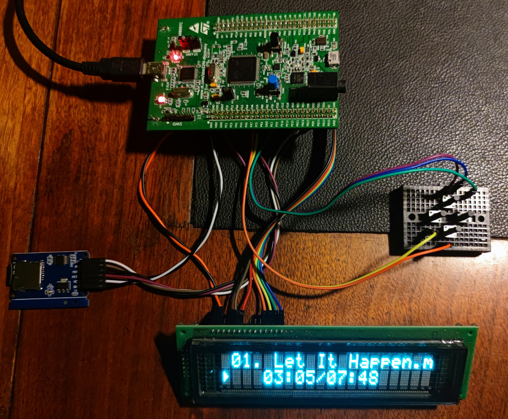

# STM32F4 SD MP3 Player

<figcaption><i>Photo of the complete project</i></figcaption>

 
 

MP3 player based on [STM32F4 Discovery board](https://www.st.com/en/evaluation-tools/stm32f4discovery.html) with STM32F407VGT6
MCU, microSD card as a storage and simple HD44780 display GUI with two views - file explorer and playback.

## Functionalities
* Playback of MP3 files with 44100Hz and 48000Hz sample rate
* Support for both CBR and VBR files
* Simple 5-button GUI with two views, based on HD44780 display
* Navigation through directories to select song to play
* Play/pause functionality
* Previous/next song functionality
* Hardware volume control
* Elapsed and total song time displayed
* Onboard CS43L22 DAC IC used
* Decoded samples transferred to DAC using DMA
* SPI mode SD card driver
* [dr_mp3](https://github.com/mackron/dr_libs/blob/master/dr_mp3.h) MP3 decoder
* [FatFs](http://elm-chan.org/fsw/ff/00index_e.html) filesystem driver

## Description
### GUI
GUI consists of two views - file explorer view and playback view.

The device starts in file explorer view. After successful initialization, the display will show the content of
the root directory of the inserted SD card, listing all the entries present there sorted alphabetically.
If the name of an entry is too long to fit on the screen, it is scrolled horizontally so that it can be seen in full. 
Pressing up and down buttons allow to scroll through the list to navigate to the specific entry. The list wraps around 
after reaching its beginning or end.

Pressing enter button will trigger an action on the entry listed in the top line of the display:
* in case it is a directory, it will result in entering this directory. The list will get updated and will contain 
the entries of the current directory. Returning to previous one is possible by pressing left button;
* in case it is a file, an attempt to start the playback will be made. The view will switch to playback mode and if 
the file has `.mp3` extension and is a valid MP3 file, the playback will start. Top line of the display will show
name of the currently played file, while bottom line will show playback status (played or paused, in the form of
an appropriate icon), elapsed playback time and total song time (or "VBR" in case of VBR MP3). When the song reaches
the end, the player will automatically play next valid MP3 from the current directory, until the end of the list
is reached; then the playback will stop;
* in case enter button was pressed on invalid MP3 file, the player will switch to playback mode and automatically
try to play next valid MP3 from the current directory, stopping when the end of the list is reached.

In playback view, pressing up and down button will result in skipping to the next or previous valid MP3 file in the 
current directory. The list wraps around after reaching its beginning or end, i.e. pressing down on the last file
in the current directory will result in starting playback from the first file. In this view, left and right button
control the volume, decrementing or incrementing its value, respectively. Note that the change is only audible,
there's no visual information about the action or current volume level. Pressing enter button will pause and resume
the playback.

To leave playback view and switch to explorer view, pause the playback by pressing enter button, then press left
button. Now pressing the right button will switch back to playback view, where the playback of the current song can
be continued from the moment it was paused, but as long as the current directory was not changed. After navigating
to another directory returning to the previously paused playback is impossible.

If current directory is empty, `Directory is empty!` text will appear on the screen.

## Hardware
### STM32F4 Discovery board
The project is built on [STM32F4 Discovery board](https://www.st.com/en/evaluation-tools/stm32f4discovery.html) - 
development board with quite powerful STM32F407VGT6 MCU with Cortex-M4 core. The board includes some peripheral
devices such as LIS302DL accelerometer, MP45DT02 microphone or CS43L22 DAC with integrated class D amplifier,
which is as an output device in this project. The board includes also ST-LINK/V2 programmer/debugger.

### Display
The display can be any HD44780-compatible alphanumeric device. The program is designed for 20x2 version (20 columns, 2 rows), 
but after a few changes in code displays with different configurations can be used too.

The exact model of my device is Futaba M202MD15FA, widely used in cash registers manufactured by Polish POSNET. 
It's a [VFD display](https://en.wikipedia.org/wiki/Vacuum_fluorescent_display), which I love for the beautiful color 
of the light they emit and their great readability even in strong direct light.

### MicroSD card
The device uses microSD card as a storage for the music files. The card is connected to the board via a microSD
card adapter with integrated level shifter. The level shifting is not really required when interfacing SD card
to STM32F407, as both of them operate in 3.3V logic, but I just had this adapter, and it turned out to work fine
in such connection.

The card functions in SPI mode, which has an advantage of being much less complex than the native SDIO protocol, at
the cost of being much slower, but in this application the obtained throughput is absolutely sufficient.
Another drawback of this mode is worse compatibility, a lot of bigger (>4GB) cards seem to not support it. I spent long
hours trying to find the bug that prevents my 16GB card from being detected only to find out that switching to old and
forgotten 2GB device solves the issue.

### Buttons
The buttons I used are typical tact-switches, but any other monostable NO switches will do.

### Connections
#### Display
| Signal | Board GPIO pin |
|--------|----------------|
| VCC    | 5V             |
| VSS    | GND            |
| RS     | PD6            |
| E      | PD7            |
| D4     | PD0            |
| D5     | PD1            |
| D6     | PD2            |
| D7     | PD3            |

#### SD card
| Signal | Board GPIO pin |
|--------|----------------|
| VCC    | 5V             |
| GND    | GND            |
| CS     | PB14           |
| SCK    | PB13           |
| MOSI   | PB15           |
| MISO   | PC2            |

_Note: the connections are shown for microSD card adapter with integrated 5V to 3.3V voltage regulator.
SD cards are 3.3V-powered, so make sure what voltage should be supplied to your module. Providing
5V directly to SD card supply pin will burn it instantly!_

#### Buttons
| Button | Board GPIO pin    |
|--------|-------------------|
| Up     | 5V                |
| Down   | GND               |
| Left   | PB14              |
| Right  | PB13              |
| Enter  | PA0 (User button) |

_Note: Buttons are connected between GPIO pin and GND, except for Enter, which is connected between GPIO and VDD.
I used onboard User button as Enter and that's just how it's connected by design. No pull-ups/pull-downs required, 
internal ones are used._

## FAQ

#### The player shows "Error: failed to mount SD card!" at the startup

There is some issue with mounting the SD card. Check all the wiring, it's very easy to connect something to
the wrong pin. Make sure the card is formatted in `FAT32` filesystem, Linux `ext2/3/4` filesystems are not supported.
If none of this helped, there's a possibility that the microSD card used does not support SPI mode, try another
one, possibly some older and with capacity less than 4GB. The exact error code can be seen by running the software
in debug mode, placing a breakpoint after `f_mount` call in `main.c` and viewing the return code from the function.

#### The sound is too fast/too slow or stutters

Corrupted, or what's even more likely, unsupported MP3 file. This player supports only MP3s with sample rate 44100Hz
or 48000Hz. It's quite simple to extend its functionality though, I just didn't have such need.

#### The device randomly freezes

Make sure that the device's power supply produces clean, stable voltage and has enough output current, especially when
using VFD display instead of regular LCD - VFDs are quite energy-hungry. I've powered it either from active USB hub or
from USB charger of good quality and at least 1A output current capability. Although average continuous current draw 
is much less than 1A, some short spikes might result in voltage drops on weaker chargers.

#### The device doesn't work at all

Double-check all the wiring - it's very easy to get lost in the maze of wires and goldpins and connect something
wrong, usually to the next or previous pin than the one where it should be connected. With properly wired display
and the software flashed to the chip the device should display at least a startup message, even without SD card and
buttons attached.

## Things to improve

### Support for other sample rates
For now only 44100Hz and 48000Hz sample rates are supported, as these are the most popular ones used to encode music
files.

### Add tags
Current implementation completely ignores tags in MP3 files - only filenames are displayed. For a second I thought about
implementing basic tags handling, but came to a conclusion that there so little space on the screen that it's not worth it.

### Detection of VBR and song total time
The algorithm of detecting whether the song is VBR or CBR and computing its length is absolutely basic and inaccurate.
Detection is based on comparing bitrate value of predefined number of MP3 frames
(see `GUI_FRAMES_TO_ANALYZE_BITRATE` in `gui.c`). The value is read at every refresh of playback view and if at least two
consecutive values differ - the bitrate is assumed to be variable. But if coincidentally all the compared frames have
the same bitrate the algorithm will fail. It will self correct on first frame with different value, but for a while
some invalid total time will be displayed.

Song length is computed by dividing file size by MP3 frame bitrate. That equation is valid only if the file is encoded
as CBR and does not contain big metadata, as e.g. album cover embedded in tags. To robustly get proper play time value
some tag handling (and Xing frame for VBR files) would be required.

### Extension case sensitivity
Currently only `.mp3` extension is considered valid, `.mP3`, `.Mp3` or `.MP3` will all fail. This is actually
very simple to change, I'll probably fix it soon. See `player.c: is_extension()`.

### Volume control "popup"
In the current implementation volume control is only audible, there's no visual information on current volume level
neither in playback view, nor after pressing the buttons controlling the volume. Some additional view might be 
added to show this value - I didn't really need it.
